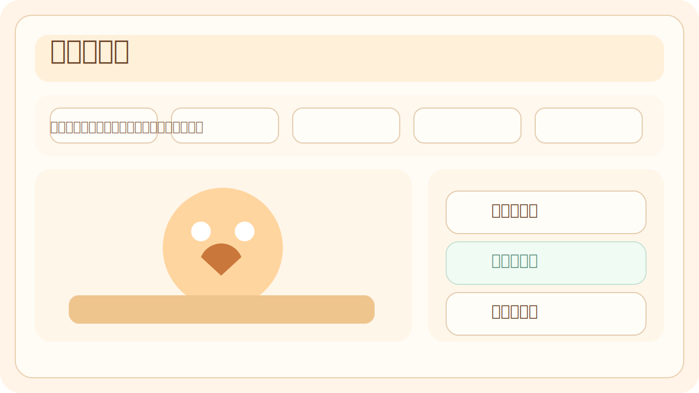

# 猫咪咖啡馆

一个轻量、可直接在浏览器运行的中文增量游戏。你要从一家刚开张的街角猫咖起步，通过手动招待客人、雇佣猫店员、升级设施和活动，最终把它经营成城市里的明星猫咖。

在线游玩地址：`https://wuhenzigua.github.io/idle-cat-cafe/`



## 玩法概览

- 点击“招待一桌客人”获得 `小鱼干`
- 使用 `小鱼干` 购买 8 种固定升级
- 达成累计营收里程碑，领取 `人气`
- 每 10 点 `人气` 提供 `+5%` 全局收益
- 达成 `总营收 >= 50000` 且 `人气 >= 80` 后解锁“明星猫咖”结算横幅

## 本地开发

```bash
npm install
npm run dev
```

## 测试与构建

```bash
npm run test
npm run build
```

## 部署说明

- `main` 分支推送后，GitHub Actions 会自动构建并部署到 GitHub Pages
- `vite.config.ts` 已固定 `base` 为 `/idle-cat-cafe/`
- 部署工作流位于 `.github/workflows/deploy-pages.yml`

## 技术栈

- Vite
- TypeScript
- 原生 DOM 渲染
- Vitest

## 许可证

MIT
